## Лабораторная работа №5
## Ошибка 1 - ошибка границы цикла (off-by-one)
**Место**: `src/casino.py`, метод `run_simulation`, 219 строка

**Симптом**: симуляция выполняет на 1 шаг больше, чем указано пользователем


**Как воспроизвести**: 
1. Запустить программу
2. Ввести любое количество шагов
3. Заметить, что выполнено на один шаг больше

**Отладка**: 
- Установлен breakpoint на строке `for step in range(1, steps + 2):`
- При пошаговом выполнение видно, что количество шагов увеличилось с 5 до 6
- Анализ кода показал, что в цикле используется неверный диапазон: `(1, steps + 2)`, который создает смещение на один шаг
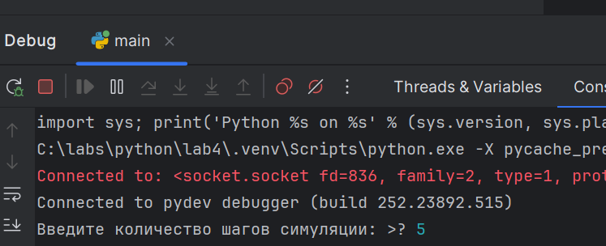
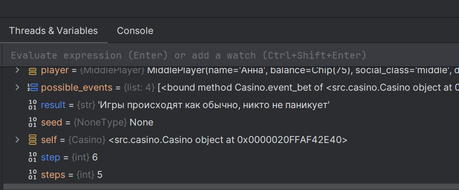

**Исправление**: строка 219 заменена на `for step in range(1, steps + 1)`
**Проверка**: поведение симуляции соответствует ожидаемому, выполняется указанное количество шагов
**Доказательства**:
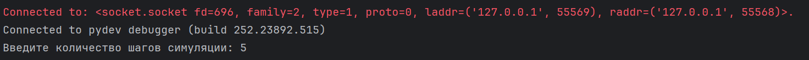
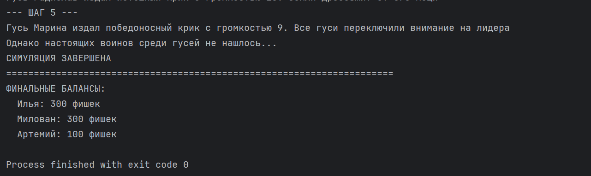

## Ошибка 2 - неверное логическое условие
**Место**: `src/casino.py`, метод `event_bet`, 79 строка

**Симптом**: гуси ставят ставки слишком часто

**Как воспроизвести**: 
1. Запустить программу
2. Указать как можно больше гусей
3. Заметить, что при появлении ивента ставки гусь ставит ставку чаще
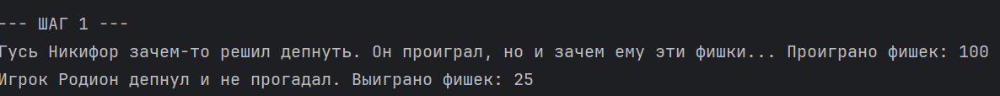
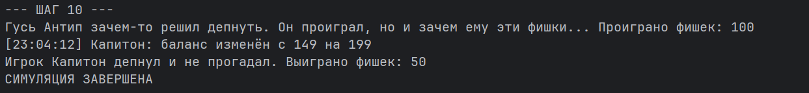

**Отладка**: 
- Установлен breakpoint на строке `bet = goose.balance`
- При пошаговом выполнении симуляции с большим количеством шагов заметим, что условие выполняется слишком часто
- Анализ кода показал, что в данный момент шанс на то, что поставит гусь, равняется 90 процентов, а по задумке должен равняться 10
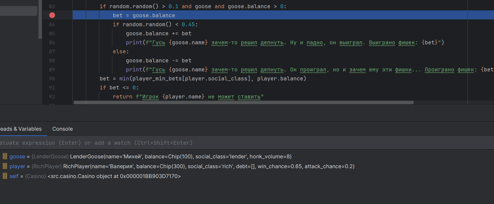
**Исправление**: строка 79 заменена на `if random.random() <= 0.1 and goose and goose.balance > 0:`
**Проверка**: поведение симуляции соответствует ожидаемому, гуси ставят ставки реже
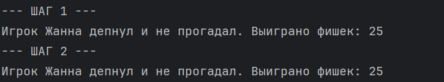
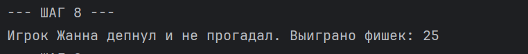
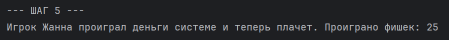

## Ошибка 3 - перепутанные аргументы или поля объеĸта
**Место**: `src/casino.py`, метод `register_player`, строка 47

**Симптом**: симуляция не запускается, метод `remove_bankrupt_players` выдает ошибку AttributeError
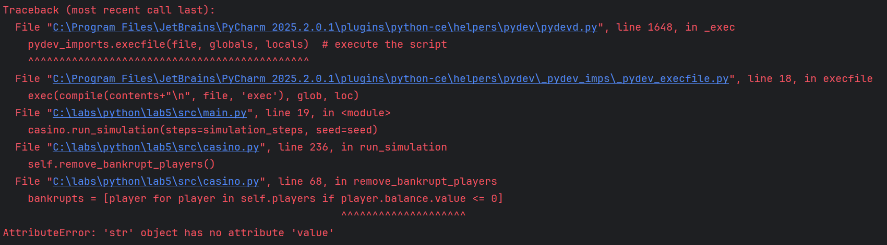
**Как воспроизвести**: 
1. Запустить программу
2. Поймать ошибку

**Отладка**: 
- Установлен breakpoint на строке `player = player_class(social_class, name)`
- Заметим, что объект класса создается с неверными данными, на каждом шаге происходит удаление обанкротившихся игроков, в том числе и на первом. При поиске игроков в генераторе списков программа не может получить параметр balance у строки
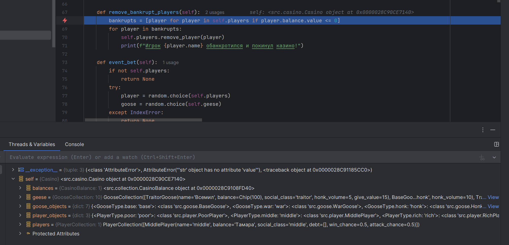
**Исправление**: строка 79 заменена на `player = player_class(name=name, social_class=social_class)`
**Проверка**: поведение симуляции соответствует ожидаемому
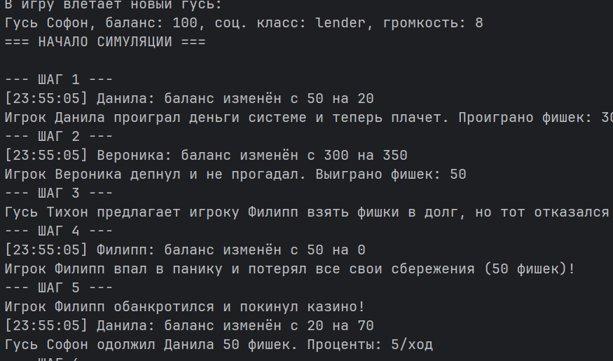

## Ошибка 4 - неправильный разбор входных данных
**Место**: `src/main.py`,8 строка
**Симптом**: при указании не числового значения для кол-ва шагов, программа должна устанавливать дефолтное значение. Однако программа "выплевывает" AttributeError
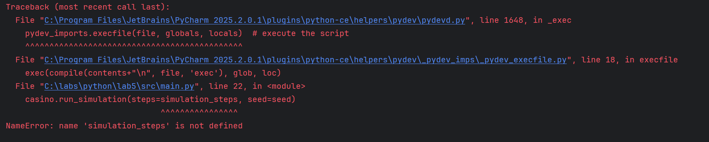
**Как воспроизвести**: 
1. Запустить программу
2. Указать не числовое значение для количества шагов
**Отладка**
- Установлен breakpoint на строке `casino.run_simulation(steps=simulation_steps, seed=seed)`
- Заметим, что на данном этапе программы значение simulation_steps не задано. Поэтому питон выбрасывает исключение
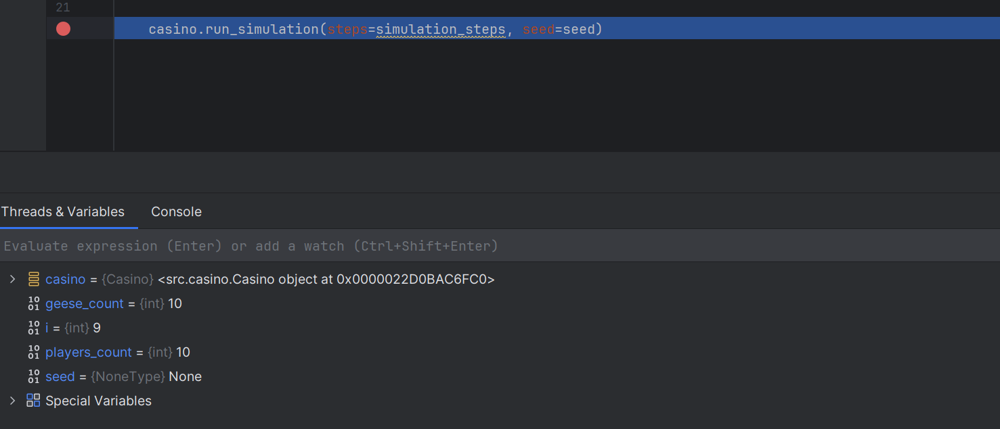
**Исправление**: строка 8 заменена на `simulation_steps = 10`
**Проверка**: поведение симуляции соответствует ожидаемому, задается дефолтное значение для количества шагов
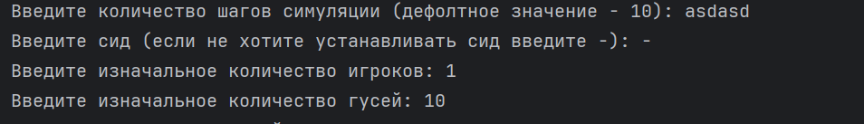
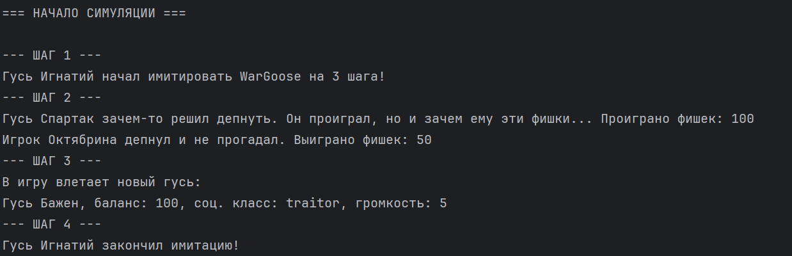

## Ошибка 5 - слишком общая обработка исключения
**Место**: `src/main.py`,13 строка
**Симптом**: при указании не того символа, который требуется для того, чтобы не устанавливать сид, выбрасывается ValueError
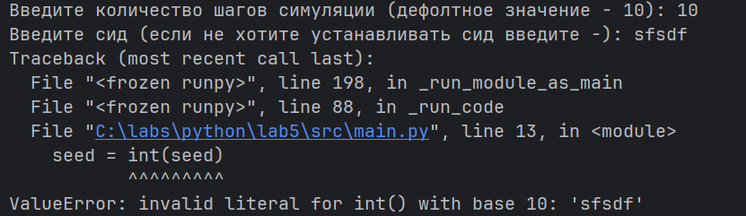
**Как воспроизвести**: 
1. Запустить программу
2. Указать любую строку кроме `-`

**Отладка**
- Установим breakpoint на условии `else` для `if seed == '-'`
- Заметим, что для перевода в int была передана строка
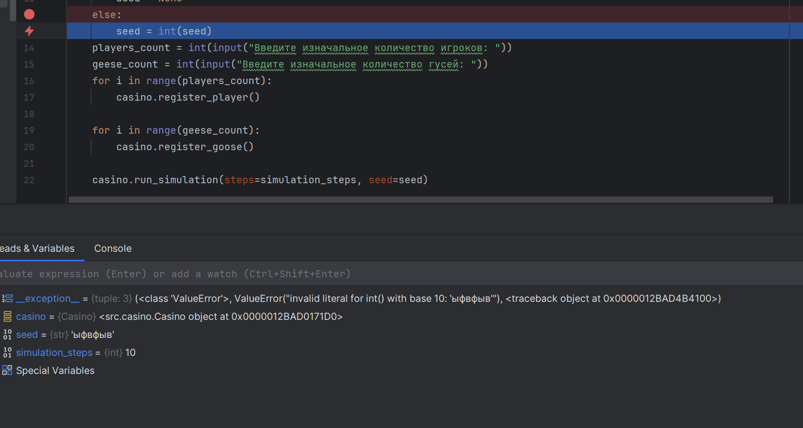
**Исправление**: полностью меняем условие `else`, добавляя `try except`
```python
else:
    try:
        seed = int(seed)
    except ValueError:
        print("Некорректное значение сида. Используется случайный сид.")
        seed = None
```
**Проверка**: поведение симуляции соответствует ожидаемому, исключение обрабатывается правильно

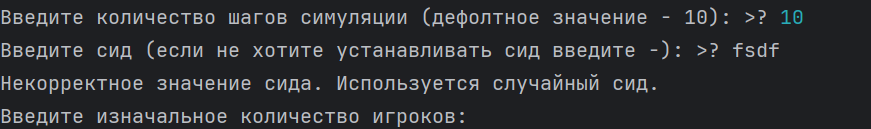


